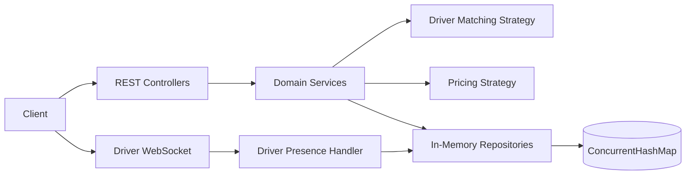
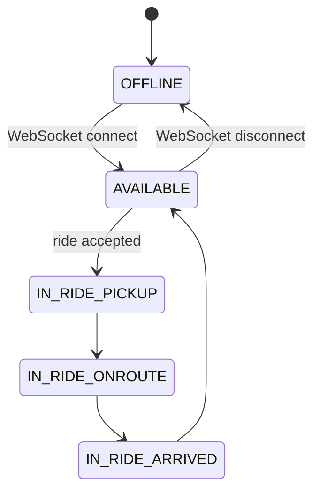
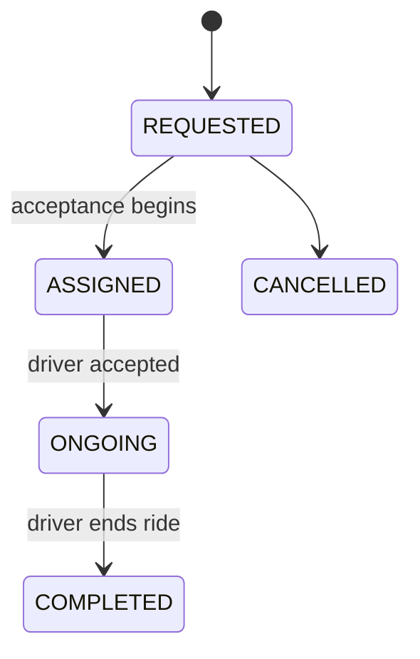

# Ride-Hailing Backend

An in-memory Spring Boot backend for a ride-hailing machine-coding exercise. The
implementation supports user and driver onboarding, driver presence, location-based
matching, configurable tiered pricing, coupons, ride lifecycle management, and
paginated ride history.

## Technology and constraints

- Java 17+
- Spring Boot 3.3
- Spring Web and WebSocket
- `ConcurrentHashMap` repositories with `AtomicLong` identifiers
- No JDBC, JPA, H2, PostgreSQL, or external services
- No Spring Security; identity is supplied by `X-User-Id` and `X-Driver-Id`
- Financial values use `BigDecimal`, scale 2, and `RoundingMode.HALF_UP`
- Responses use the standard `ApiResponse<T>` envelope

## Architecture



The service layer owns business rules. Matching and pricing are strategy-based so
their implementations can be replaced without changing the ride lifecycle. Repositories
provide thread-safe in-memory storage and secondary indexes for unique fields.

## Running the application

```bash
mvn spring-boot:run
```

The server starts on `http://localhost:8080`.

Run the test suite with:

```bash
mvn test
```

The application reads configuration from `src/main/resources/application.yml`.

## API overview

All successful responses are HTTP 200 and use:

```json
{
  "statusCode": 200,
  "success": true,
  "message": "Operation successful",
  "data": {},
  "error": null
}
```

Known validation and domain failures use HTTP 400 or 404 and the same envelope.

### User APIs

| Method | Path | Identity | Purpose |
|---|---|---|---|
| POST | `/api/v1/users` | None | Register a user |
| POST | `/api/v1/rides/request` | `X-User-Id` | Request and price a ride |
| GET | `/api/v1/users/rides/history?page=0&size=10` | `X-User-Id` | View rides from the last 30 days |

Ride request body:

```json
{
  "pickupX": 0,
  "pickupY": 0,
  "destX": 3,
  "destY": 4,
  "carType": "SEDAN",
  "couponCode": "SAVE10"
}
```

### Driver APIs

| Method | Path | Identity | Purpose |
|---|---|---|---|
| POST | `/api/v1/drivers` | None | Register a driver and vehicle |
| PATCH | `/api/v1/drivers/{driverId}/location` | None | Update the driver's current coordinates |
| POST | `/api/v1/rides/{rideId}/accept` | `X-Driver-Id` | Accept a matched ride |
| POST | `/api/v1/rides/{rideId}/end` | `X-Driver-Id` | Complete a ride |
| POST | `/api/v1/rides/{rideId}/cancel` | `X-User-Id` | Cancel an active ride |
| GET | `/api/v1/drivers/rides/history?page=0&size=10` | `X-Driver-Id` | View rides from the last 2 days |

Ride completion body:

```json
{
  "destX": 3,
  "destY": 4
}
```

### Admin coupon APIs

| Method | Path | Purpose |
|---|---|---|
| POST | `/api/v1/admin/coupons` | Create an active coupon |
| DELETE | `/api/v1/admin/coupons/{code}` | Deactivate a coupon |

Coupon codes are normalized to uppercase. Coupon usage is tracked per user and
enforced atomically in memory.

### Matching, ratings, surge, and cancellation

`PUT /api/v1/admin/matching-strategy` switches between `NEAREST` and
`HIGHEST_RATED` at runtime (the response remains wrapped in `ApiResponse`).
Drivers can receive a 1–5 rating through `POST /api/v1/drivers/{id}/rating`;
the matching strategy uses the running average, then distance and driver ID as
deterministic tie breakers.

Area demand/supply can be configured with
`PUT /api/v1/admin/surge/areas/{area}` and `{ "demand": 3, "supply": 1 }`.
The pluggable surge strategy applies a capped `max(1, demand / supply)`
multiplier to the request fare. Cancellation is allowed for active rides,
releases the reserved driver, and is free during the configured
`ride-hailing.cancellation.free-window-seconds`; later cancellations use the
configured fee.

### Driver presence

Connect a driver to:

```text
ws://localhost:8080/ws/driver/{driverId}
```

Connection sets the driver to `AVAILABLE`; disconnection sets the driver to
`OFFLINE`. The driver must be connected before it can be matched.

Connected drivers may also send live location frames:

```json
{
  "type": "LOCATION_UPDATE",
  "x": 12.5,
  "y": 8.0
}
```

## State machines





The current acceptance endpoint completes the `ASSIGNED` transition atomically
and exposes the ride as `ONGOING` after a successful acceptance.

## Matching and pricing

Matching uses Euclidean distance:

```text
distance = sqrt((x2 - x1)^2 + (y2 - y1)^2)
```

`NearestDriverStrategy` considers available drivers with a known location and a
distance within the configured search radius. Equal-distance matches are resolved
by driver ID for deterministic behavior. A Hatchback request falls back to a
Sedan when no Hatchback is available; the fare still uses Hatchback pricing.

Pricing uses cumulative distance tiers. Example configuration:

```yaml
ride-hailing:
  matching:
    search-radius-km: 5.0
  pricing:
    minimum-fare-floor: 50.00
    tiers:
      SEDAN:
        - max-distance: 5
          rate-per-distance: 12.00
        - max-distance: 10
          rate-per-distance: 10.00
        - rate-per-distance: 8.00
```

For a 12-unit Sedan trip, the calculation is:

```text
(5 × 12) + (5 × 10) + (2 × 8) = 102.00
```

The minimum fare is applied before coupon discounts. The fare is recalculated
from the actual destination when the ride ends. Coupons apply a percentage
discount capped by `maxDiscountAmount`, and the payable fare cannot be negative.

## Concurrency and consistency

- Repository maps are concurrent.
- User locks prevent multiple active rides from being created concurrently.
- Driver reservation locks prevent multiple requests from selecting the same driver.
- Driver locks serialize competing acceptance requests.
- Coupon usage counters are synchronized per user and coupon.
- Completed ride receipts are not reopened or edited by lifecycle operations.

These locks are process-local and intentionally match the in-memory scope of the
exercise. A distributed deployment would require database transactions or a
distributed locking/idempotency mechanism.

## Trade-offs and production extensions

### In-memory persistence

This keeps the exercise focused and fast, but all data is lost on restart and
the application cannot scale horizontally with consistent state. A production
implementation would replace repositories with transactional persistence,
unique database constraints, and an external cache where appropriate.

### Custom headers instead of authentication

Headers make the machine-coding APIs easy to exercise. Production traffic should
use authenticated principals, authorization checks, token rotation, and audit
logging.

### WebSocket presence

Presence is process-local and disconnect-driven. Production systems should add
heartbeats, reconnect handling, stale-session expiry, multi-device semantics,
and a shared presence store or broker.

### Matching

The current linear scan is suitable for a small in-memory exercise. Large fleets
would use geospatial indexing, partitioning, driver availability leases, and
dispatch retries.

### Pricing and coupons

Pricing tiers are configuration-backed and coupons are usage-counted in memory.
Production billing should use an immutable fare snapshot, currency/tax rules,
auditable coupon redemption records, and idempotent payment integration.

## Extending the implementation

1. Add a new `DriverMatchingStrategy` implementation and inject it as the
   selected strategy bean.
2. Add new `CarType` values and corresponding pricing tiers in `application.yml`.
3. Add a repository method and service query for new history filters.
4. Add ride cancellation with a guarded `REQUESTED`/`ONGOING` transition and
   an explicit refund/coupon policy.
5. Replace the in-memory repositories behind their existing service contracts
   without changing controller payloads.
6. Add authentication at the controller boundary while preserving service-level
   ownership checks.

## Test coverage

The suite covers:

- Registration and uniqueness rules
- Repository indexes and ID generation
- WebSocket connect/disconnect presence
- Euclidean matching, radius boundaries, and deterministic ties
- Cumulative pricing, minimum fares, rounding, and invalid tier definitions
- Coupon caps, deactivation, validation, and concurrent usage
- Ride request/accept/end lifecycle and concurrency edge cases
- User and driver history windows, pagination, and response envelopes

## AI-assisted development

The implementation was developed incrementally according to the machine-coding
plan. AI assistance was used for repository exploration, scaffolding, test-case
generation, and review of edge cases. Domain rules, API contracts, concurrency
behavior, configuration values, and final code decisions were verified against
the exercise requirements and the test suite.
